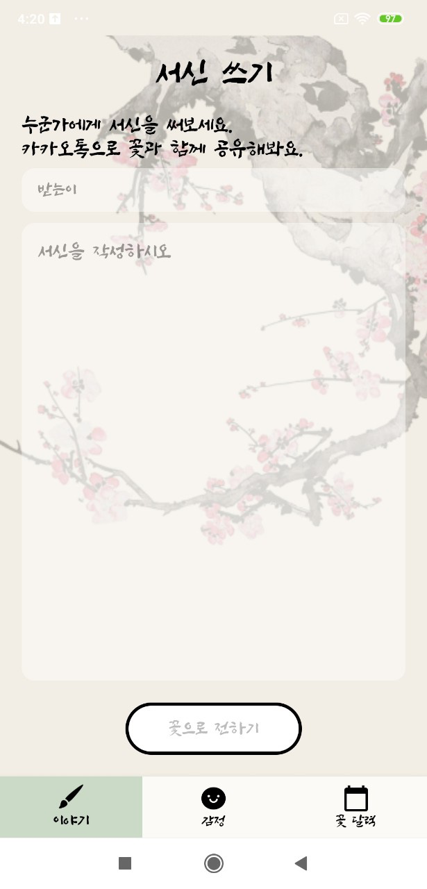
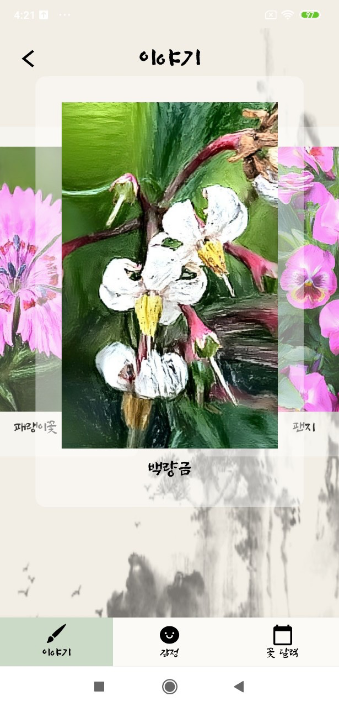
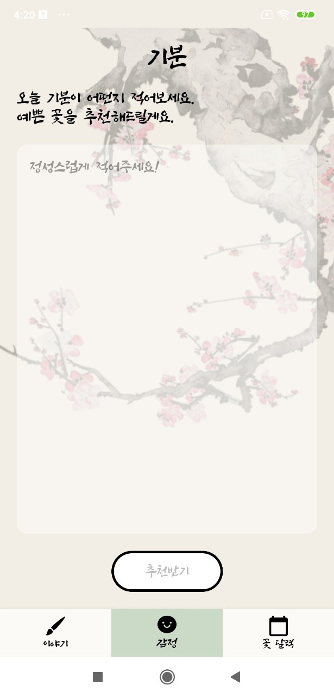
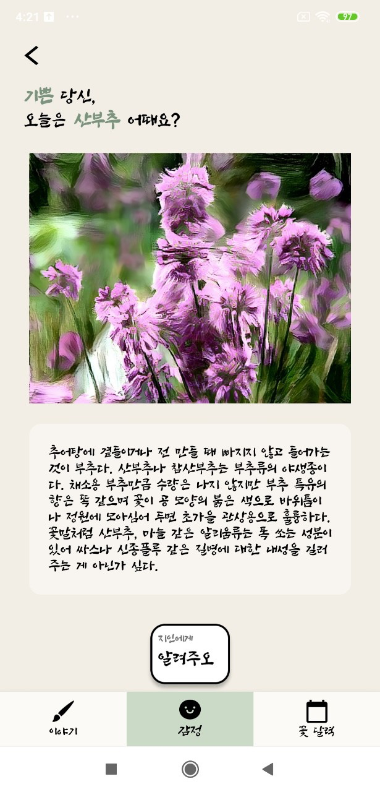
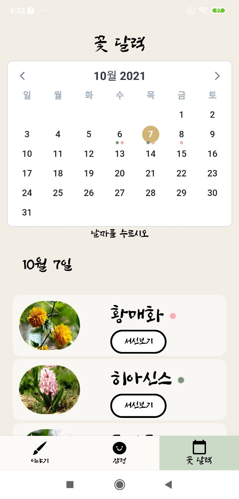

# 🌸 담화 Frontend 

> 향기롭게 마음을 전하는 방법, 담화 입니다.

프론트엔드 개발은 Android와 iOS 두 플랫폼을 통해 개발했으며, 내부에 Webview를 사용하여 하이브리트 형식으로 만들었습니다. 아래 정확한 테크스택을 적어두겠습니다.

## Android

### ✔️Android Studio IDE Setup

For development, the latest version of Android Studio is required. 

### 🛠 Teck Stack

- Foundation 

  - AppCompat
  - Android KTX
  - Jetpack Navigation
  - Fragment
  - ViewPager2

- Architecture

  - Data Binding
  - Lifecycles
  - ViewModel

- Third party and miscellaneous libraries

  - Glide

  - Retrofit

  - OkHttp

  - Firebase

  - RxJava, RxAndroid, RxKotlin

  - CarouselRecyclerView

  - Kakao SDK

  - Lottie

    

### 🪜 Architecture

아키텍처의 경우 MVVM 및 Repository 패턴을 사용하였습니다.

또한, DI 라이브러리를 사용하지 않았기 때문에 의존성의 경우 따로 DamhwaInjection 오브젝트를 만들어 주입해주는 형식으로 사용했습니다.

### 📷 ScreenShots

#### 1. 서신쓰기 > 추천

#### 2. 기분쓰기 > 추천

#### 3. 꽃 달력 -> 상세보기 (Vue.js)

## iOS

## Web

웹의 경우 웹뷰를 구현하기 위해 사용하였습니다.

Calendar와, 서신보는 페이지 및 감정기록 보는 페이지 총 3개의 페이지로 구성되어있습니다.

### ✔️Visual Studio Code IDE Setup

For development, the latest version of Visual Studio Code is required. 

### 🛠 Teck Stack

- Vue.js 
- Vue-router 
- Boostrap5 

### 📷 ScreenShots

